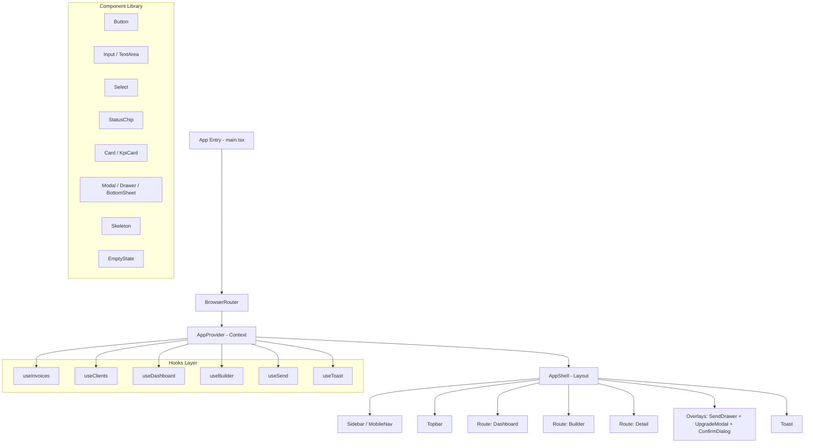
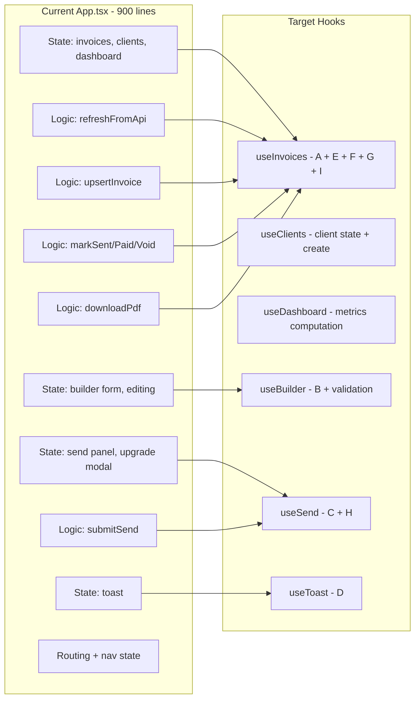
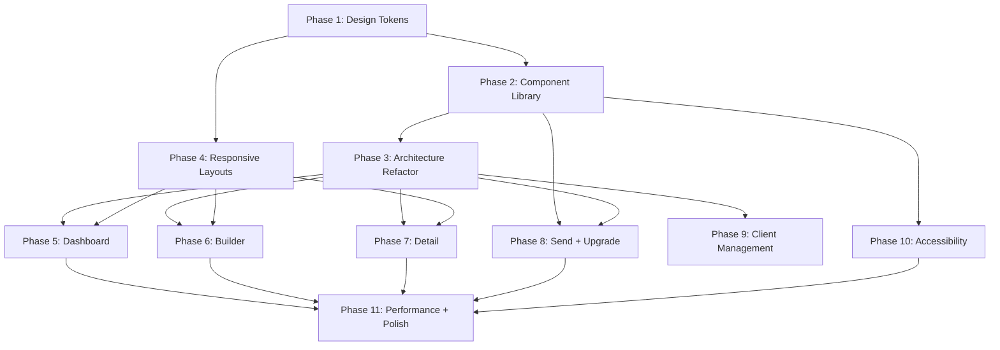

# SmartInvoice Frontend Buildout Plan

## Current State Assessment

The web frontend has a working foundation with all 3 core screens implemented in a single-page React + TypeScript + Vite app. The app runs with both a live API backend and a local fallback mode using in-memory data.

### What Exists Today

| Area | Status | Notes |
|------|--------|-------|
| Dashboard page | ✅ Basic | KPI cards, recent invoices table, needs attention panel |
| Invoice Builder | ✅ Basic | Form inputs, line items, live preview, client picker |
| Invoice Detail | ✅ Basic | Status, actions, preview, timeline |
| API integration | ✅ Complete | Full CRUD, send email, mark sent/paid/void, PDF download |
| Routing | ✅ Complete | React Router with dashboard, builder, detail, edit routes |
| Send Panel | ✅ Basic | Modal overlay with form fields |
| Upgrade Modal | ✅ Basic | Simple modal with upgrade CTA |
| Toast notifications | ✅ Basic | Success/error/info toasts |
| Mobile nav | ✅ Basic | Bottom nav bar at 920px breakpoint |
| Fallback mode | ✅ Complete | Full local CRUD when API unavailable |

### Critical Gaps

| Gap | Impact | Priority |
|-----|--------|----------|
| Monolithic `App.tsx` (900+ lines) | Blocks maintainability and testing | High |
| Incomplete design tokens | Visual inconsistency with spec | High |
| Only 2 CSS breakpoints | Poor tablet and small phone experience | High |
| No reusable component library | Duplicated patterns, inconsistent states | High |
| No loading skeletons | Perceived performance issues | Medium |
| No autosave indicator | User confidence gap in builder | Medium |
| `window.confirm` for void | Not accessible, not styled | Medium |
| No client management surface | Missing product requirement | Medium |
| Missing accessibility | WCAG non-compliance | Medium |
| No mobile stepper builder | Builder unusable on phones | High |

---

## Architecture Overview



### Target File Structure

```
src/
├── main.tsx
├── App.tsx                          # Slim shell: providers + router
├── api.ts                           # API client (keep as-is)
├── app/
│   ├── types.ts                     # Shared types
│   ├── invoiceUtils.ts              # Pure utility functions
│   ├── transformers.ts              # API response transformers
│   └── fallbackData.ts              # Demo data
├── context/
│   ├── AppProvider.tsx              # Combined context provider
│   ├── useInvoices.ts               # Invoice CRUD + status transitions
│   ├── useClients.ts                # Client list + create
│   ├── useDashboard.ts              # Metrics computation
│   ├── useBuilder.ts                # Builder form state + validation
│   ├── useSend.ts                   # Send panel state + submission
│   └── useToast.ts                  # Toast queue management
├── components/
│   ├── ui/                          # Design system primitives
│   │   ├── Button.tsx
│   │   ├── Input.tsx
│   │   ├── TextArea.tsx
│   │   ├── Select.tsx
│   │   ├── StatusChip.tsx
│   │   ├── Card.tsx
│   │   ├── KpiCard.tsx
│   │   ├── Modal.tsx
│   │   ├── Drawer.tsx
│   │   ├── BottomSheet.tsx
│   │   ├── Toast.tsx
│   │   ├── Skeleton.tsx
│   │   ├── EmptyState.tsx
│   │   └── ConfirmDialog.tsx
│   ├── AppShell.tsx                 # Layout grid + sidebar + mobile nav
│   ├── Sidebar.tsx                  # Desktop sidebar nav
│   ├── MobileNav.tsx                # Bottom tab bar
│   ├── Topbar.tsx                   # Top bar with create CTA
│   ├── InvoicePreview.tsx           # Invoice render component
│   ├── SendDrawer.tsx               # Send invoice right drawer / bottom sheet
│   ├── UpgradeModal.tsx             # Premium gate modal
│   └── ClientDrawer.tsx             # Client list + inline create
├── pages/
│   ├── DashboardPage.tsx
│   ├── BuilderPage.tsx              # Desktop split view
│   ├── BuilderMobilePage.tsx        # Mobile stepper flow
│   └── DetailPage.tsx
├── styles/
│   ├── tokens.css                   # Design system tokens only
│   ├── reset.css                    # CSS reset + base styles
│   ├── components.css               # Component-level styles
│   ├── layouts.css                  # Grid and layout styles
│   └── utilities.css                # Utility classes
└── index.css                        # Import orchestrator
```

---

## Phase 1: Design System Foundation

**Goal:** Align CSS tokens with [`designsystem.md`](../designsystem.md) spec and establish the visual foundation.

### Tasks

1. **Create `tokens.css`** with all tokens from the design system spec:
   - Color tokens: brand, neutrals, status, surfaces, text, interactive
   - Typography: Import Manrope font, define type scale tokens
   - Spacing: Complete `space-1` through `space-12`
   - Radius: `radius-sm`, `radius-md`, `radius-lg`, `radius-pill`
   - Elevation: `shadow-1`, `shadow-2`, `shadow-3`
   - Motion: `duration-fast`, `duration-standard`, `duration-emphasized`, easing

2. **Create `reset.css`** with base element styles consuming tokens

3. **Migrate `index.css`** to use new token names consistently:
   - Replace `--bg` with `--color-bg`
   - Replace `--surface` with `--color-surface`
   - Replace `--text` with `--color-text-primary`
   - Replace `--text-muted` with `--color-text-secondary`
   - Replace `--line` with `--color-border`
   - Replace `--brand` with `--color-brand-500`
   - Replace `--critical` with `--color-danger-500`
   - Replace `Space Grotesk` with `Manrope`

4. **Add reduced motion media query** respecting OS preferences

### Key Decisions
- Keep CSS-only approach (no CSS-in-JS or Tailwind) to match current codebase
- Token names follow `--color-{semantic}-{shade}` convention from spec
- All component styles must reference tokens, never hardcoded values

---

## Phase 2: Reusable Component Library

**Goal:** Extract design system primitives that enforce consistent states and accessibility.

### Components to Build

| Component | Variants | States |
|-----------|----------|--------|
| `Button` | primary, secondary, ghost, destructive | default, hover, focus, pressed, disabled, loading |
| `Input` | text, email, number, date | default, focus, filled, error, disabled |
| `TextArea` | default | default, focus, filled, error, disabled |
| `Select` | default | default, focus, error, disabled |
| `StatusChip` | Draft, Sent, Overdue, Paid, Void | — |
| `Card` | default, kpi | — |
| `KpiCard` | — | default, loading skeleton |
| `Modal` | center | open, closed |
| `Drawer` | right | open, closed |
| `BottomSheet` | — | open, closed |
| `Toast` | success, error, info, warning | enter, visible, exit |
| `Skeleton` | text, card, table-row | — |
| `EmptyState` | — | — |
| `ConfirmDialog` | — | open, closed |

### Component Contract Rules
- Every interactive component accepts `aria-label` or `aria-labelledby`
- Every button variant has a `loading` prop that shows spinner and disables interaction
- Every input has `label`, `error`, and `helperText` slots
- Overlays trap focus and close on Escape
- All components use design tokens, zero hardcoded values

---

## Phase 3: App.tsx Architecture Refactor

**Goal:** Decompose the 900-line `App.tsx` into focused hooks and a slim shell.

### Hook Extraction Plan



### Extraction Steps

1. **`useToast`** — Simplest; extract toast state + auto-dismiss timer
2. **`useClients`** — Client list state, create client, select client
3. **`useDashboard`** — Metrics computation from invoices + API summary
4. **`useBuilder`** — Builder form state, validation, item CRUD, patch logic
5. **`useInvoices`** — Invoice list, CRUD, status transitions, PDF download, API refresh
6. **`useSend`** — Send panel visibility, form state, submission, upgrade gate
7. **`AppProvider`** — Compose all hooks into a single context provider
8. **Slim `App.tsx`** — Only BrowserRouter + AppProvider + Routes + overlays

### Rules
- Hooks communicate via shared context, not prop drilling
- Each hook is independently testable
- API mode (connected vs fallback) is handled inside each hook transparently

---

## Phase 4: Responsive Layout System

**Goal:** Implement all 6 breakpoints from [`wireframespec.md`](../wireframespec.md) with proper grid system.

### Breakpoint Implementation

| Token | Range | Grid | Padding | Layout |
|-------|-------|------|---------|--------|
| `xs` | 320-374px | 4 col | 16px | Single column, bottom nav |
| `sm` | 375-767px | 4 col | 16px | Single column, bottom nav |
| `md` | 768-1023px | 8 col | 24px | Compact rail or top tabs |
| `lg` | 1024-1279px | 12 col | 24px | Sidebar + content |
| `xl` | 1280-1439px | 12 col | 32px | Sidebar + content |
| `2xl` | 1440px+ | 12 col | 32px | Sidebar + content |

### CSS Media Query Strategy

```css
/* Mobile first: xs is default */
/* sm */  @media (min-width: 375px) { }
/* md */  @media (min-width: 768px) { }
/* lg */  @media (min-width: 1024px) { }
/* xl */  @media (min-width: 1280px) { }
/* 2xl */ @media (min-width: 1440px) { }
```

### Layout Changes
- **AppShell**: Sidebar hidden below `lg`, mobile nav shown below `md`
- **Dashboard**: KPI grid 1-col on xs/sm, 2x2 on md, 3-col on lg+
- **Builder**: Full-width stepper on xs/sm, segmented tabs on md, split view on lg+
- **Detail**: Stacked on xs/sm, stacked with collapsible sections on md, split on lg+

---

## Phase 5: Dashboard Enhancements

**Goal:** Match dashboard to [`wireframespec.md`](../wireframespec.md) Screen A specs.

### Tasks
1. Add loading skeleton state (3 KPI skeleton cards + table skeleton rows)
2. Implement proper empty state with headline, body, and CTA per [`designsystem.md`](../designsystem.md) section 5.10
3. Mobile layout: sticky top summary card, secondary cards below, activity list with card format
4. Tablet layout: 2x2 or 1x3 KPI cards, list cards instead of dense table
5. Desktop: current layout refined with proper column ratios (8:4)
6. Add `Create Invoice` as persistent CTA visible within one gesture on all breakpoints

---

## Phase 6: Builder Improvements

**Goal:** Make the builder work excellently across all device classes.

### Desktop (lg+)
- Sticky preview panel that scrolls independently
- Autosave indicator: `Draft saved`, `Saving...`, `Saved` states
- Inline validation on blur (not just on submit)
- Keyboard-first flow: Tab through fields, Enter to add item

### Tablet (md)
- Segmented control tabs: Client, Items, Tax, Notes, Preview
- Preview expandable to full screen

### Mobile (xs/sm)
- **New `BuilderMobilePage.tsx`** with stepper flow:
  - Step 1: Client + dates
  - Step 2: Line items
  - Step 3: Tax + notes
  - Step 4: Preview and actions
- Sticky footer with Back / Next / Save
- Decimal keypad for currency fields

### Shared
- Replace raw `<select>` with searchable client picker
- Currency format lock after first line item
- Notes template quick insert

---

## Phase 7: Detail Page Polish

**Goal:** Complete the invoice action hub per [`wireframespec.md`](../wireframespec.md) Screen C specs.

### Tasks
1. Replace `window.confirm` with styled `ConfirmDialog` for void action
2. Desktop: proper header row with invoice number, client, status, amount, action buttons
3. Desktop: split layout — left 8 cols preview, right 4 cols timeline + metadata
4. Tablet: actions in overflow menu, preview full width, collapsible timeline accordion
5. Mobile: top summary (id + status + amount), preview thumbnail, bottom sticky action bar with Download, Edit, More menu
6. Timeline visual improvements: connected line, icons per event type
7. Disable edit button with tooltip for Paid/Void invoices

---

## Phase 8: Send Panel and Upgrade Modal

**Goal:** Match send surface behavior to device type per [`wireframespec.md`](../wireframespec.md) section 6.

### Send Invoice Surface
| Device | Surface Type | Width |
|--------|-------------|-------|
| Desktop lg+ | Right drawer | min 420px |
| Tablet md | Full modal | — |
| Phone xs/sm | Bottom sheet (70-90% height) | — |

### Tasks
1. Convert `SendPanel` to `SendDrawer` with responsive surface switching
2. Add retry button on send failure
3. Add timeout handling with progress indicator
4. Save unsent draft message content on close
5. Success state with `Resend` action in toast

### Upgrade Modal
1. Desktop: center modal (current behavior, refine styling)
2. Phone/tablet: bottom sheet
3. Improve copy to focus on outcome per [`productdesign.md`](../productdesign.md) section 7

---

## Phase 9: Client Management

**Goal:** Add lightweight client management surface per product spec.

### Tasks
1. Create `ClientDrawer` component (right drawer on desktop, bottom sheet on mobile)
2. Client list with search/filter
3. Inline client creation form
4. Client edit capability
5. Integration with builder: select client from drawer populates builder fields
6. Client detail view showing invoice history (stretch goal)

---

## Phase 10: Accessibility

**Goal:** Meet WCAG 2.1 AA baseline per [`designsystem.md`](../designsystem.md) section 8.

### Tasks
1. Add `aria-label` to all icon-only buttons (Remove item, close overlay, etc.)
2. Implement focus trap in Modal, Drawer, BottomSheet, ConfirmDialog
3. Add `role="dialog"` and `aria-modal="true"` to all overlays (partially done)
4. Keyboard navigation: logical tab order through all forms
5. Arrow key navigation in line item table rows
6. Focus ring styling using `--color-focus-ring` token
7. Screen reader announcements for toast messages (`role="status"` exists, verify)
8. Contrast audit: verify all text/background combinations meet 4.5:1 ratio
9. Text scaling test: verify layout at 200% zoom
10. Reduced motion: wrap all animations in `prefers-reduced-motion` query

---

## Phase 11: Performance and Polish

**Goal:** Meet performance targets from [`wireframespec.md`](../wireframespec.md) section 9.

### Tasks
1. Add React error boundaries around each page
2. Lazy load pages with `React.lazy` + `Suspense`
3. Optimize re-renders: memoize expensive computations, use `React.memo` on pure components
4. Add loading skeleton for initial API bootstrap (replace current text-only loading)
5. Animation polish: stagger reveals, smooth drawer transitions, toast enter/exit
6. Visual QA pass across all breakpoint classes
7. Verify input latency < 100ms in builder
8. Verify dashboard initial render performance

---

## Execution Order and Dependencies



**Critical path:** Phase 1 → Phase 2 → Phase 3 → Phases 5-9 (parallel) → Phase 11

Phase 4 (Responsive) can run in parallel with Phase 2-3 since it is primarily CSS work.

Phase 10 (Accessibility) should be woven into Phases 2-9 incrementally, with a final audit pass.

---

## Risk Notes

- **Phase 3 (Architecture Refactor)** is the highest-risk phase. Extracting hooks from a working monolith requires careful state migration. Recommend incremental extraction (one hook at a time) with manual testing after each.
- **Phase 6 (Mobile Builder Stepper)** is the most complex new feature. It requires a new page component with step state management and shared builder state.
- **Phase 4 (Responsive)** touches every page. Recommend implementing mobile-first CSS and testing each breakpoint before moving to the next phase.
